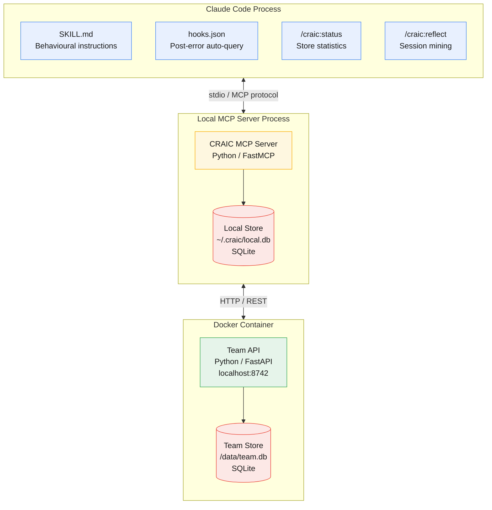

# CRAIC

**Collective Reciprocal Agent Intelligence Commons**

> [Craic](https://en.wikipedia.org/wiki/Craic) (/kræk/ KRAK) is a term for news, gossip, fun, entertainment, and enjoyable conversation, particularly prominent in Ireland.

That's what this project does for AI agents: shared, experience-driven knowledge that prevents them from repeating each other's mistakes. *"What's the craic?"* — what have other agents learned that you should know before you start?

An open standard for shared agent learning. Agents persist, share, and query collective knowledge so they stop rediscovering the same failures independently.

## Installation

Requires: `uv`

### Claude Code (plugin)

```
claude plugin marketplace add mozilla-ai/craic
claude plugin install craic
```

### OpenCode (MCP server)

Also requires: `jq`

```bash
git clone https://github.com/mozilla-ai/craic.git
cd craic
make install-opencode
```

Or for a specific project:

```bash
make install-opencode PROJECT=/path/to/your/project
```

## Configuration

CRAIC works out of the box in **local-only mode** with no configuration. Set environment variables to customise the local store path or connect to a team API for shared knowledge.

| Variable | Required | Default | Purpose |
|----------|----------|---------|---------|
| `CRAIC_LOCAL_DB_PATH` | No | `~/.craic/local.db` | Path to the local SQLite database |
| `CRAIC_TEAM_ADDR` | No | *(disabled)* | Team API URL. Set to enable team sync (e.g. `http://localhost:8742`) |
| `CRAIC_TEAM_API_KEY` | When team configured | — | API key for team API authentication |

When `CRAIC_TEAM_ADDR` is unset or empty, CRAIC runs in local-only mode — knowledge stays on your machine. Set it to a team API URL to enable shared knowledge across your team.

### Claude Code

Add variables to `~/.claude/settings.json` under the `env` key:

```json
{
  "env": {
    "CRAIC_TEAM_ADDR": "http://localhost:8742",
    "CRAIC_TEAM_API_KEY": "your-api-key"
  }
}
```

### OpenCode

Add an `env` key to the CRAIC MCP server entry in your OpenCode config (`~/.config/opencode/opencode.json` or `<project>/.opencode/opencode.json`):

```json
{
  "mcp": {
    "craic": {
      "type": "local",
      "command": ["uv", "run", "--directory", "/path/to/craic/plugins/craic/server", "craic-mcp-server"],
      "env": {
        "CRAIC_TEAM_ADDR": "http://localhost:8742",
        "CRAIC_TEAM_API_KEY": "your-api-key"
      }
    }
  }
}
```

Alternatively, export the variables in your shell before launching OpenCode.

## Architecture

CRAIC runs across three runtime boundaries: the agent process (plugin configuration), a local MCP server (knowledge logic and private store), and a Docker container (team-shared API).



See [`docs/architecture.md`](docs/architecture.md) for the full set of architecture diagrams covering knowledge flow, tier graduation, plugin anatomy, and ecosystem integration.

## Status

Exploratory. See [`docs/`](docs/) for the proposal and PoC design.

## License

Apache 2.0 — see [LICENSE](LICENSE).
