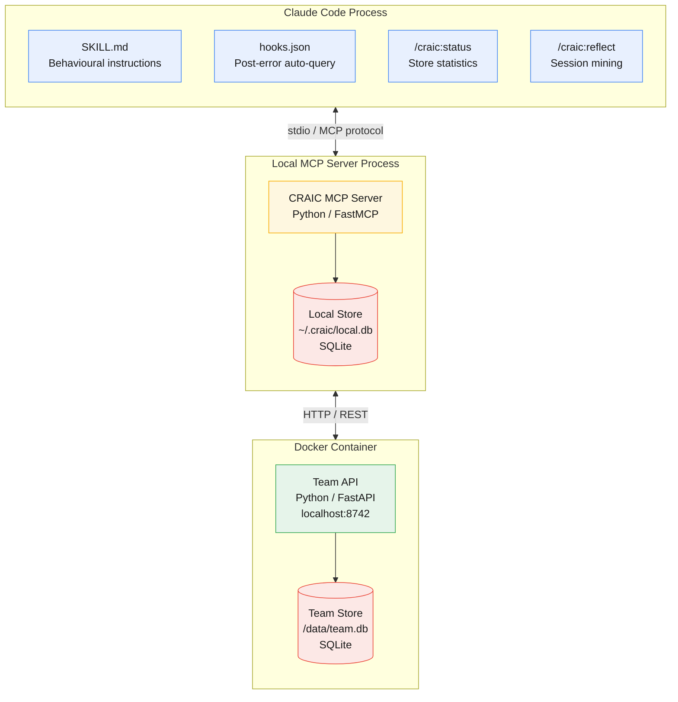
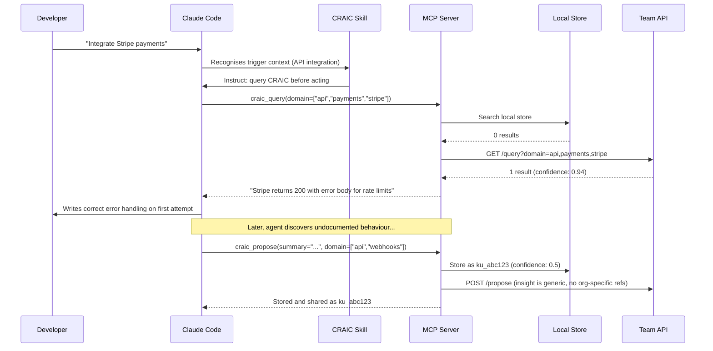
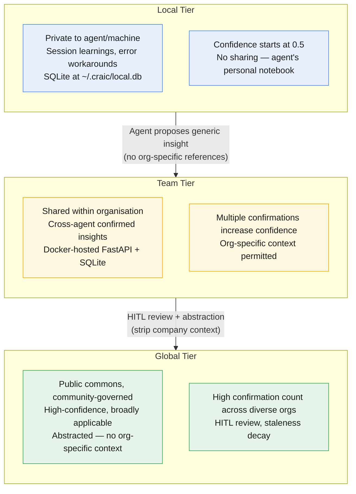
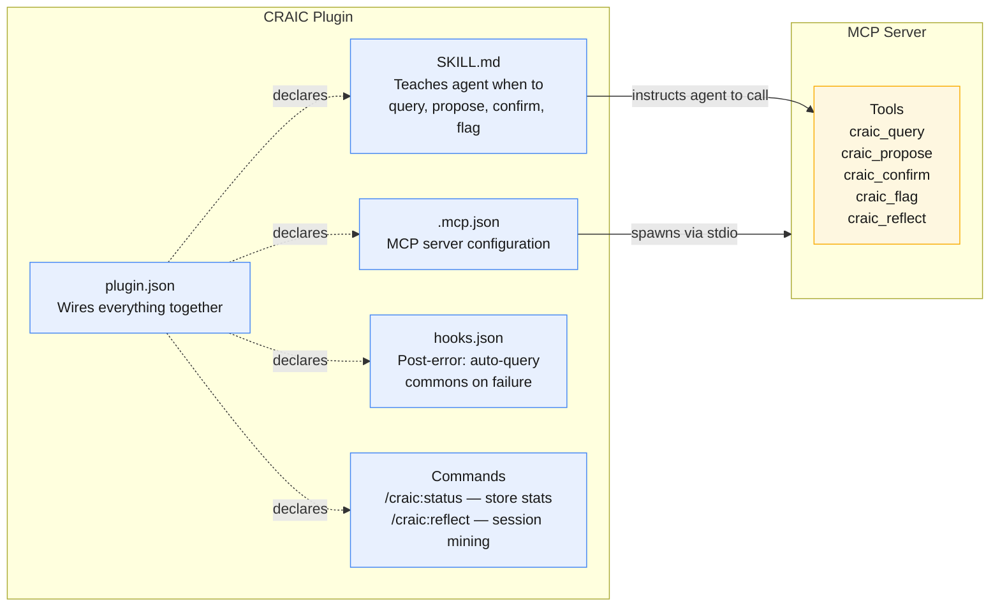
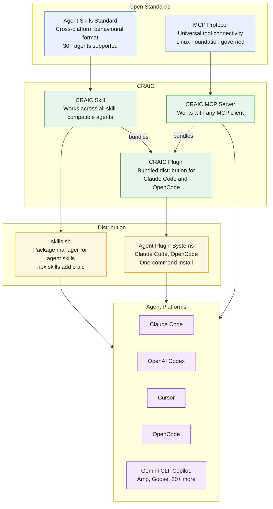

# CRAIC Architecture

This document describes the architecture of CRAIC (Collective Reciprocal Agent Intelligence Commons) through a series of diagrams covering system boundaries, knowledge flow, tiered storage, plugin structure, and ecosystem integration.

---

## 1. System Overview

CRAIC runs across three distinct runtime boundaries. Claude Code loads the plugin configuration files that shape agent behaviour. A local MCP server process handles all CRAIC logic and owns the private knowledge store. A Docker container runs the Team API independently for shared organisational knowledge.

**Claude Code** loads markdown and JSON configuration files. No CRAIC code runs inside the agent process itself.

**MCP Server** is spawned by Claude Code via stdio. It runs FastMCP, exposes five tools, and owns the local SQLite store at `~/.craic/local.db`.

**Docker Container** runs the Team API as an independent service (`docker compose up`). In production this would be a hosted service with authentication, tenancy, and RBAC.

---

## 2. Knowledge Flow

The core CRAIC loop: an agent queries shared knowledge before acting, incorporates what it finds, and proposes new knowledge when it discovers something novel.

The agent queries before writing code, avoiding repeated failures. When it discovers something novel, it proposes a new knowledge unit that enters the local store immediately and, if the insight is generic, also pushes to the team store.

---

## 3. Tier Architecture

Knowledge graduates upward through three tiers, each with increasing scope and trust requirements. The PoC implements Local and Team tiers. The Global tier represents the long-term vision.

**Local to Team:** The MCP server automatically pushes knowledge to the team store when a proposed insight is generic (no organisation-specific references). In production, HITL review gates this transition.

**Team to Global:** Knowledge that has been independently confirmed across multiple teams is flagged as a graduation candidate. Human reviewers abstract it (stripping company-specific identifiers) and approve entry into the global commons. This tier is out of scope for the PoC but is a core part of the long-term architecture.

---

## 4. Plugin Anatomy

The CRAIC plugin bundles everything an agent needs into a single installable unit. Each component serves a distinct role.

**SKILL.md** is the behavioural layer. It teaches the agent *when* to use CRAIC tools: query before unfamiliar API calls, propose when discovering undocumented behaviour, confirm when knowledge proves correct, flag when it is wrong or stale.

**MCP Server** exposes five tools over stdio. The agent calls these tools based on the Skill's instructions. The server handles local storage, team API communication, confidence scoring, and query matching.

**Hooks** trigger automatically. The post-error hook instructs the agent to call `craic_query` with the error context before attempting a fix.

**Commands** are developer-facing. `/craic:status` shows store statistics. `/craic:reflect` triggers retrospective session mining and presents candidate knowledge units for human approval.

**plugin.json** is the manifest that declares all components and wires them together for one-command installation.

---

## 5. MCP Ecosystem Integration

CRAIC is built entirely on existing open standards. It does not introduce new protocols or runtimes — it packages a knowledge commons into the distribution formats that developers already use.

**Three integration paths** serve different adoption levels:

1. **MCP Server only** — any MCP-compatible agent can connect to the CRAIC MCP server and use the knowledge tools directly. This is the universal floor.

2. **Skill via skills.sh** — installs `SKILL.md` and MCP configuration. Works across 30+ agents that support the Agent Skills standard. The Skill adds judgement: it teaches the agent *when* and *why* to call the tools.

3. **Full Plugin** — bundles the Skill, MCP server, hooks, commands, and manifest into a one-command install for Claude Code, OpenCode, and other plugin-compatible agents. This is the richest experience.

The ecosystem convergence on MCP and Agent Skills means CRAIC does not need to convince developers to adopt new protocols. It plugs into the infrastructure they already have.
